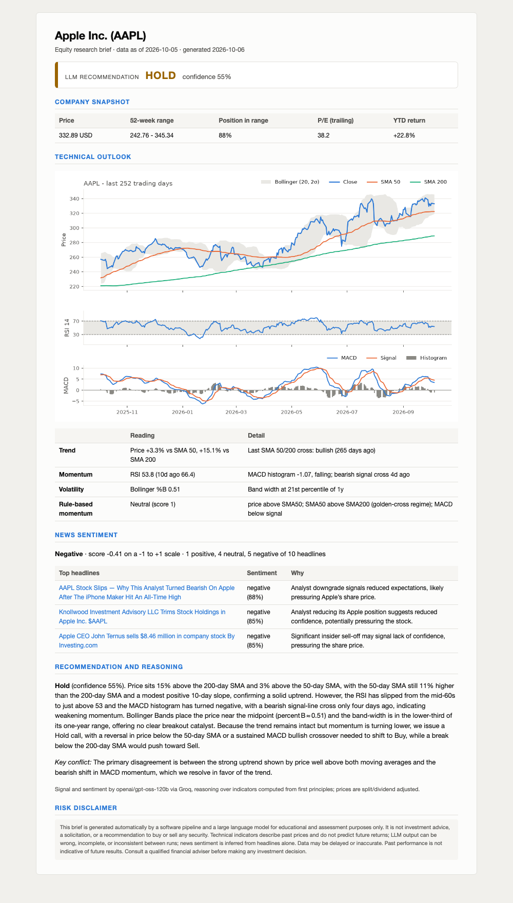

# Task 1 - LLM-Powered Equity Research Assistant

[](https://colab.research.google.com/github/indeewara/CDAZZDEV-MLE-IndeewaraJayasuriya/blob/main/task1_financial/task1_equity_research.ipynb)
&nbsp; Notebook: [`task1_equity_research.ipynb`](task1_equity_research.ipynb) (all outputs visible)

Ingests real market data for a ticker (default **AAPL**), computes technical indicators from first principles, gathers
news, then uses an LLM to score headline sentiment and issue a reasoned Buy/Hold/Sell signal, rendered as a one-page
research brief.

| Part | File | What it does |
|---|---|---|
| 1A | [`data_pipeline.py`](data_pipeline.py) | 3 years of daily OHLCV from yfinance (relative period, no hardcoded dates); SMA 50/200, RSI 14 (Wilder), MACD (12, 26, 9), Bollinger (20, 2σ) in pandas/numpy - no TA-Lib; 10 headlines; summary dict (price, 52-week range, P/E, YTD return, rule-based momentum signal) |
| 1B | [`llm_reasoning.py`](llm_reasoning.py) | per-headline sentiment JSON + confidence-weighted aggregate; Buy/Hold/Sell signal reasoned over derived indicator relationships |
| 1B | [`schemas.py`](schemas.py) | Pydantic models - every LLM response is validated; failures are logged, sent back for repair, then handled gracefully |
| 1B | [`prompts.py`](prompts.py) | all prompt text (system/user roles), separate from the logic |
| Bonus | [`report.py`](report.py) | Markdown brief rendered to a styled one-page HTML with an embedded matplotlib chart → [`outputs/AAPL_brief.html`](outputs/AAPL_brief.html) |
| Tests | [`test_indicators.py`](test_indicators.py), [`test_llm_reasoning.py`](test_llm_reasoning.py) | 30 offline tests: indicators against Wilder's textbook example and independent loop implementations, missing-data handling, schema validation and repair path, aggregation, signal context |

## Bonus: one-page research brief
[`outputs/AAPL_brief.html`](outputs/AAPL_brief.html) (styled HTML, chart embedded, prints on one A4 page) and
[`outputs/AAPL_brief.md`](outputs/AAPL_brief.md). Rendered:



**LLM:** `openai/gpt-oss-120b` via the Groq free tier (Llama-3-70B is no longer offered there), temperature 0, JSON mode.

**News source:** yfinance's news endpoint is tried first, but returned no headlines during development, so the
pipeline falls back to the free **Google News RSS** feed (then Yahoo Finance RSS). Headlines are de-duplicated and
diversified (at most 2 per publisher, near-duplicate stories removed). Google News RSS is public but unofficial, which
is why there is a fallback chain.

## Run locally
```bash
python -m venv .venv && source .venv/bin/activate
pip install -r requirements.txt
cp .env.example .env              # then add your free Groq key: GROQ_API_KEY=...
python task1_financial/data_pipeline.py          # Task 1A only (no API key needed)
python task1_financial/llm_reasoning.py AAPL     # 1A + 1B
python task1_financial/report.py AAPL            # full brief -> task1_financial/outputs/AAPL_brief.html
pytest task1_financial
```
On Colab, add `GROQ_API_KEY` as a Colab Secret and run all cells.

*Not investment advice - see the disclaimer in the brief.*
