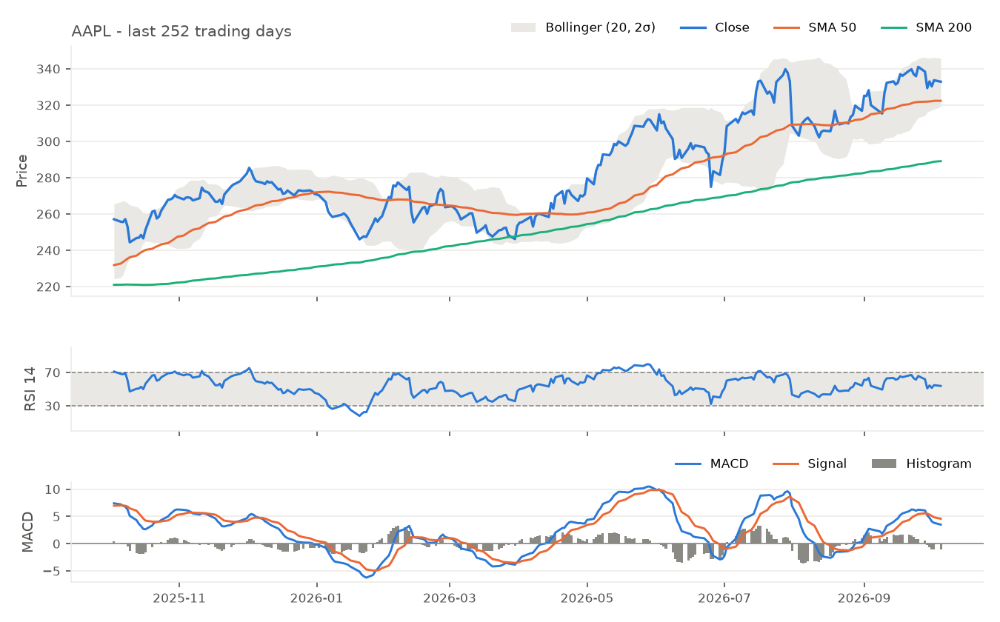

# Apple Inc. (AAPL)
Equity research brief · data as of 2026-10-05 · generated 2026-10-06

LLM recommendation<strong>HOLD</strong><em>confidence 55%</em>

## Company snapshot

| Price | 52-week range | Position in range | P/E (trailing) | YTD return |
|---|---|---|---|---|
| 332.89 USD | 242.76 - 345.34 | 88% | 38.2 | +22.8% |

## Technical outlook

| | Reading | Detail |
|---|---|---|
| **Trend** | Price +3.3% vs SMA 50, +15.1% vs SMA 200 | Last SMA 50/200 cross: bullish (265 days ago) |
| **Momentum** | RSI 53.8 (10d ago 66.4) | MACD histogram -1.07, falling; bearish signal cross 4d ago |
| **Volatility** | Bollinger %B 0.51 | Band width at 21st percentile of 1y |
| **Rule-based momentum** | Neutral (score 1) | price above SMA50; SMA50 above SMA200 (golden-cross regime); MACD below signal |

## News sentiment

**Negative** · score -0.41 on a -1 to +1 scale · 1 positive, 4 neutral, 5 negative of 10 headlines

| Top headlines | Sentiment | Why |
|---|---|---|
| [AAPL Stock Slips — Why This Analyst Turned Bearish On Apple After The iPhone Maker Hit An All-Time High](https://news.google.com/rss/articles/CBMi2wFBVV95cUxPVGV0SWk5UEVoRjJURGNrTy1YVjRjbG1iQTYzbXhDTVp1ejFOTlRmVkV6ckxDRjYxeldYMnRvbG9QMlZBMXBCNW1tQVNQTlRfZXUxN3NjQWN6ZDA4QTlqLXF4eDZYZWJCOTU2STFxcDIwQ0NpWmJibkk4cWpSVzBRUHBxdjdNbzhHUEpDaHZjWkRkUC1HWWhyTTVtNjJ2WW9SSzUtOWFja0xrNzROa25aZlFkNDFEdkJrNGIxQXB6NWp4Xy13bl9GRTJOdVFJRi13Sjlva2lUQ2swMUk?oc=5) | negative (88%) | Analyst downgrade signals reduced expectations, likely pressuring Apple’s share price. |
| [Knollwood Investment Advisory LLC Trims Stock Holdings in Apple Inc. $AAPL](https://news.google.com/rss/articles/CBMizgFBVV95cUxOX0Y1V2xwcmtzQ1dFZGx0OWtCVzdBYjZwTEdiS1JyTWJzVHhMWU1vZGFkaDZMZTVsZjFLZDZjWkwzOTVqSVlvbnZsaXN6NGNSNEdtTHhMZTlTejduSEZLSHBlYXM1RE1VZ19IMmdmTnlPNnppVVU4NTlDRGozbGY4OWRwX20yVmlMUW1hdGNCUG4xNWJNMnN0SjFSTmVxa0VCcDdUVHVZTnNZNGVBSS04d0ZodmJPWFdrQ09BUXpHRWZNcnQtWkpzeXRFb3lvQQ?oc=5) | negative (85%) | Analyst reducing its Apple position suggests reduced confidence, potentially pressuring the stock. |
| [Apple CEO John Ternus sells $8.46 million in company stock By Investing.com](https://news.google.com/rss/articles/CBMiuAFBVV95cUxPbVlFemhJcUxpbldzXzg1VzV5RGdaRk9rbjlzM1JJVU84U3g2LVNwNGdxUzk0dEVtQktkMnlIYWdwMTJrUlA1UEh1RmdwdndBSVJPYklnWWFhVWx5eHNuV3ZZZFBJS2R0WTFBYk5NQmplZFhkRnpPTEw2QnIxRVNFZ1MwQTFvYnJWMHV2Y0tSekx4aVZDQ2FvTlhieFFjMGpZSmdkMWR1WFlkeWJlaFZjVmNRUjRtZnJy?oc=5) | negative (85%) | Significant insider sell-off may signal lack of confidence, pressuring the share price. |

## Recommendation and reasoning

**Hold** (confidence 55%). Price sits 15% above the 200‑day SMA and 3% above the 50‑day SMA, with the 50‑day SMA still 11% higher than the 200‑day SMA and a modest positive 10‑day slope, confirming a solid uptrend. However, the RSI has slipped from the mid‑60s to just above 53 and the MACD histogram has turned negative, with a bearish signal‑line cross only four days ago, indicating weakening momentum. Bollinger Bands place the price near the midpoint (percent B ≈ 0.51) and the band‑width is in the lower‑third of its one‑year range, offering no clear breakout catalyst. Because the trend remains intact but momentum is turning lower, we issue a Hold call, with a reversal in price below the 50‑day SMA or a sustained MACD bullish crossover needed to shift to Buy, while a break below the 200‑day SMA would push toward Sell.

*Key conflict:* The primary disagreement is between the strong uptrend shown by price well above both moving averages and the bearish shift in MACD momentum, which we resolve in favor of the trend.

<small>Signal and sentiment by openai/gpt-oss-120b via Groq, reasoning over indicators computed from first principles; prices are split/dividend adjusted.</small>

## Risk disclaimer

This brief is generated automatically by a software pipeline and a large language model for educational and assessment purposes only. It is not investment advice, a solicitation, or a recommendation to buy or sell any security. Technical indicators describe past prices and do not predict future returns; LLM output can be wrong, incomplete, or inconsistent between runs; news sentiment is inferred from headlines alone. Data may be delayed or inaccurate. Past performance is not indicative of future results. Consult a qualified financial adviser before making any investment decision.
