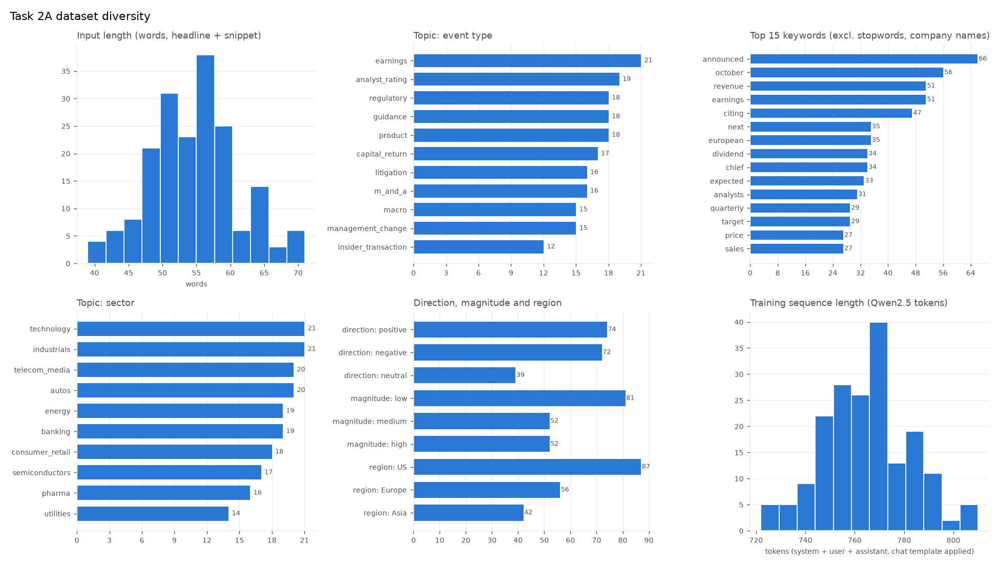

# Task 2 - Financial News Impact Analysis (Domain-Specific Fine-Tuning)

[](https://colab.research.google.com/github/indeewara/CDAZZDEV-MLE-IndeewaraJayasuriya/blob/main/task2_genai/task2_news_impact_finetuning.ipynb)
&nbsp; Notebook: [`task2_news_impact_finetuning.ipynb`](task2_news_impact_finetuning.ipynb) (dataset → QLoRA training → evaluation)

**Fine-tuned model (merged, public):**
[huggingface.co/Indee99/qwen2.5-1.5b-financial-news-impact](https://huggingface.co/Indee99/qwen2.5-1.5b-financial-news-impact)
- QLoRA adapter merged into Qwen2.5-1.5B-Instruct with `merge_and_unload()`; loads with plain `transformers`, no PEFT.

## Problem statement

### The problem
Equity research desks and trading systems receive thousands of financial news items a day. For each one they need a
consistent, structured record of **what happened, who it affects, whether it is good or bad for the stock and how much,
and why** - in a fixed format a downstream system can filter, count and alert on.

Humans cannot read everything. A sentiment model (e.g. FinBERT, or the headline step in Task 1) only says
positive/negative and cannot distinguish a guidance cut from an earnings miss. Large API models do the job well but are
costly and slow at volume and send data to a third party. A small open model with a prompt is cheap and private but
**inconsistent**: it invents its own category names, breaks the JSON format, states facts that are not in the text, and
gives vague reasoning.

**Goal:** fine-tune a small open model (runs on a free Colab T4) so that it produces this structured analysis
measurably more consistently, more accurately and with fewer hallucinations than the same model with a prompt alone.

### Input
One financial news item: a headline and a 1-3 sentence snippet, as plain text.

```
Headline: Nike cuts full-year revenue outlook as China demand slows
Snippet: Nike Inc. lowered its fiscal-year revenue growth forecast to 2% from 5%, citing weaker footwear demand in
Greater China. Shares fell 7% in after-hours trading.
```

### Output
A single JSON object, nothing else, with exactly these keys:

| Field | Type / allowed values | Meaning |
|---|---|---|
| `event_type` | one of the 11 types below | the event that drives the item (if several, the one the headline leads with) |
| `primary_entity` | string | the company most affected; for `macro`, the sector or index most affected (e.g. "US regional banks") |
| `mentioned_entities` | list of strings | every company, regulator or person named **in the input**, and nothing else |
| `impact_direction` | `positive` \| `negative` \| `neutral` | expected effect on the primary entity's share price |
| `magnitude` | `low` \| `medium` \| `high` | expected size of that effect (rules below) |
| `rationale` | string, 2-3 sentences | why: the specific driver, and second-order effects where relevant |

```json
{
  "event_type": "guidance",
  "primary_entity": "Nike Inc.",
  "mentioned_entities": ["Nike Inc."],
  "impact_direction": "negative",
  "magnitude": "high",
  "rationale": "Nike cut its full-year revenue growth forecast from 5% to 2%, signalling that weak China demand is a lasting problem rather than a one-quarter miss. Guidance cuts typically weigh on a stock more than a single earnings miss because they reset expectations for the whole year, and the slowdown may also pressure its Asian suppliers."
}
```

### Event taxonomy (11 types)

| `event_type` | Covers |
|---|---|
| `earnings` | reported quarterly/annual results versus expectations |
| `guidance` | changes to forward outlook (raised, cut, reaffirmed) |
| `analyst_rating` | upgrades, downgrades, price-target changes, initiations |
| `m_and_a` | acquisitions, mergers, divestitures, spin-offs |
| `capital_return` | dividends, buybacks, special distributions |
| `insider_transaction` | executive or director share purchases and sales |
| `regulatory` | approvals, investigations, fines, new rules aimed at the company or its sector |
| `litigation` | lawsuits, verdicts, settlements |
| `product` | launches, recalls, major contract wins or losses |
| `management_change` | CEO/CFO/chair appointments and departures |
| `macro` | rates, inflation, tariffs, policy - affects a sector or index rather than one company |

### Labelling rules
- **Direction** is about the share price of `primary_entity`, not the tone of the writing. Routine items (scheduled
  10b5-1 insider sales, reaffirmed guidance, small fund position changes) are `neutral`.
- **Magnitude:** `low` = routine or largely expected; `medium` = a notable surprise or a meaningful change for one
  business line; `high` = changes the investment case (large guidance cut, transformative deal, major fine or recall,
  sudden CEO exit). A `neutral` direction always has `low` magnitude.
- **Rationale structure:** sentence 1 names the specific driver with the key fact from the text; sentence 2 explains why
  it moves the price in this direction and by this much; an optional sentence 3 covers second-order effects.
- **Grounding:** `mentioned_entities` and any figure, date or name in the `rationale` must come from the input. The
  rationale may discuss second-order effects only in general terms ("its suppliers", "rival chipmakers") - it must not
  name companies or cite numbers that are not in the input.

### What counts as correct
Each model output is graded in this order - the first rule that applies decides:

| Grade | Definition |
|---|---|
| **Hallucinated** | states as fact an entity, figure or event that is not in the input (in any field) |
| **Incorrect** | not valid JSON, missing/extra keys, a value outside the allowed set, wrong `event_type`, or the opposite `impact_direction` (positive vs negative) |
| **Partially correct** | valid and grounded, correct `event_type`, but `impact_direction` is off by one step (e.g. neutral vs negative), `magnitude` differs, `primary_entity` is wrong, or the rationale is vague / does not name the specific driver |
| **Correct** | valid and grounded; `event_type`, `impact_direction`, `magnitude` and `primary_entity` all match the reference; the rationale names the specific driver and is consistent with the labels |

Hallucination rate = hallucinated / reviewed outputs (Task 2C reviews at least 10 by hand).

### How this maps to the evaluation (Task 2C)
- **ROUGE-L** on `rationale`, base model versus fine-tuned, on the same held-out test set.
- **Field-level accuracy** on `event_type`, `impact_direction`, `magnitude`, plus the JSON-validity rate.
- **LLM-as-judge** scoring against the rubric above, returning structured JSON - using a judge from a different model
  family than the data-generating teacher, so it does not favour its own style.
- **Manual review** of at least 10 fine-tuned outputs with the four grades above, giving the hallucination rate.

## Dataset (Task 2A)

**185 examples - train 149 (80.5%) / validation 18 (9.7%) / test 18 (9.7%)** - in
[`data/train.jsonl`](data/train.jsonl), [`data/val.jsonl`](data/val.jsonl), [`data/test.jsonl`](data/test.jsonl).
The split is stratified by event type (every type appears in validation and test) and rounded across the whole
dataset; 18 is the nearest whole number to 10% of 185.

### How it was generated
Synthetic data: real, well-known companies with **fictional** events. Built by
[`generate_data.py`](generate_data.py); every stage is cached, so it is reproducible and resumable.

| Stage | What happens |
|---|---|
| 1. Plan (code) | 240 balanced specs (11 event types × 10 sectors × 50 companies in US/Europe/Asia × direction × magnitude × 4 writing styles), plus a 45-spec top-up for the 4 hardest event types |
| 2. Generate | **Teacher: `openai/gpt-oss-120b`** (Groq free tier) writes a headline, snippet and reference analysis per spec, 6 specs per call |
| 3. Blind label | **`openai/gpt-oss-20b`** labels each item from the text alone (never sees the spec) |
| 4. Filter | keep only if schema-valid, grounded (every name/number in the input) and the blind label agrees (same event type and direction, magnitude within one step) |
| 5. Clean | strip meta-phrases the teacher leaked from the style ("A breaking-news alert reported that ...") - 22 items; add the main company to `mentioned_entities` where omitted - 24 items |
| 6. Dedupe, split, write | drop copies and same-scenario items, stratified 80/10/10, chat-format JSONL |

**Yield:** 185 of 285 planned (65%). Rejected: 82 blind-label disagreements, 14 ungrounded, 4 duplicates.
Llama-3-70B (suggested in the brief) has been retired on Groq, so `gpt-oss-120b` - the strongest free model available
there - is the teacher. The student is **Qwen2.5-1.5B-Instruct**, a different model family from the teacher.

**Full prompts used for generation:** [`TEACHER_PROMPTS.md`](TEACHER_PROMPTS.md) (written verbatim from
[`news_prompts.py`](news_prompts.py), so it always matches the code).

### Diversity



| Metric | Value |
|---|---|
| Event types / sectors / companies | 11 (12-21 each) / 10 (14-21 each) / 50 |
| Regions | US 87, Europe 56, Asia 42 |
| Direction | positive 74, negative 72, neutral 39 |
| Magnitude | low 81, medium 52, high 52 |
| Writing styles | 4 (43-48 each) |
| Input length (words) | min 39, median 54, mean 54.6, max 71 |
| Training sequence length (Qwen2.5 tokens) | 722-810 (mean 765) |
| Distinct word bigrams (unique / total) | 0.67 |
| Nearest-neighbour similarity, word level (each snippet vs its most similar other snippet) | mean 0.28, p95 0.43, max 0.50 - no near-duplicates |

Word-level similarity counts shared common words ("the", "said", "%"), so unrelated financial snippets already score
about 0.2-0.3; a near-copy scores above 0.8.

### Format
Each JSONL line is one conversation with **system, user and assistant turns**
(`{"messages": [{"role": "system", ...}, {"role": "user", ...}, {"role": "assistant", ...}]}`): the system turn is the
task instructions, the user turn is the news item, and the assistant turn is the reference JSON analysis. All 185
records were checked programmatically (correct roles, exact system prompt, schema-valid and grounded target - 0
problems). At training time Qwen2.5's own chat template is applied with `tokenizer.apply_chat_template`; one record
rendered in that template is saved in [`data/sample_chat_template.txt`](data/sample_chat_template.txt):

```text
<|im_start|>system
You are a financial news analyst. Given one news item (headline and snippet), classify the event ...<|im_end|>
<|im_start|>user
Headline: ...
Snippet: ...<|im_end|>
<|im_start|>assistant
{"event_type": "earnings", "primary_entity": "Novo Nordisk", ..., "rationale": "..."}<|im_end|>
```

## Fine-tuning (Task 2B)

Notebook: [`task2_news_impact_finetuning.ipynb`](task2_news_impact_finetuning.ipynb) (run on a Colab T4).
Code: [`finetune.py`](finetune.py) - every hyperparameter is a named constant with its justification beside it, and
the notebook repeats them as a table.

| | |
|---|---|
| Base model | Qwen2.5-1.5B-Instruct, loaded in 4-bit NF4 with double quantization, fp16 compute |
| LoRA | r 16, alpha 32, dropout 0.05, all 7 linear projections (q, k, v, o, gate, up, down) |
| Training | 3 epochs, lr 2e-4 cosine with 10% warm-up, batch 4 × accumulation 4 = 16, max length 1024, paged AdamW 8-bit |
| Loss | assistant tokens only (the 600-token system prompt is masked out) |
| Output | adapter merged with `merge_and_unload()` into a 16-bit base, pushed to the Hugging Face Hub: [Indee99/qwen2.5-1.5b-financial-news-impact](https://huggingface.co/Indee99/qwen2.5-1.5b-financial-news-impact) |
| Loss per epoch | train 1.135 → 0.801 → 0.670; **validation 0.945 → 0.881 → 0.862** (falls every epoch; the narrowing improvement at epoch 3 is why training stops there) |

The training code path (data format, prompt masking, LoRA targets, per-epoch evaluation, merge) was smoke-tested on
CPU with a tiny Qwen2 model before the GPU run.

### Known limitations of the data
- **Labels come from the teacher**, so evaluation measures how closely the student matches a strong teacher on this
  task, not agreement with real-world market reactions.
- **`insider_transaction` is the smallest type (12)**: whether a sale is routine or significant is genuinely
  ambiguous, so the blind check rejected most of them even after the top-up.
- **Dates cluster in October** ("october" is the 2nd most frequent keyword): the teacher anchored on the generation
  month.
- **US-heavy (47%)**, and completeness of `mentioned_entities` is only partly enforced (the main company is added
  automatically; other omitted names, e.g. a central bank, are not detected).
